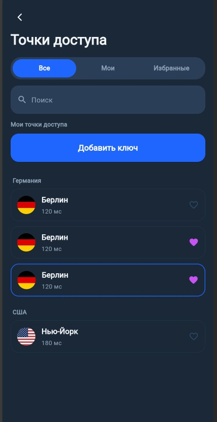

# VPN Server Picker

Экран выбора серверов для VPN-приложения.  
Реализован в рамках тестового задания на позицию Flutter-разработчика.

## Реализовано

- Экран выбора серверов по макету Figma
- Вкладки: **Все / Мои / Избранные**
- Поиск по названию сервера
- Добавление/удаление сервера в избранное
- Пустое состояние при отсутствии результатов
- Выбор активного сервера
- Адаптивная верстка (проверено на разных размерах экранов)

## Архитектура

- Flutter
- BLoC (flutter_bloc)
- UI-only реализация без backend-зависимостей
- Mock-данные

## Скриншот



## Запуск проекта

```bash
flutter pub get
flutter run
```
